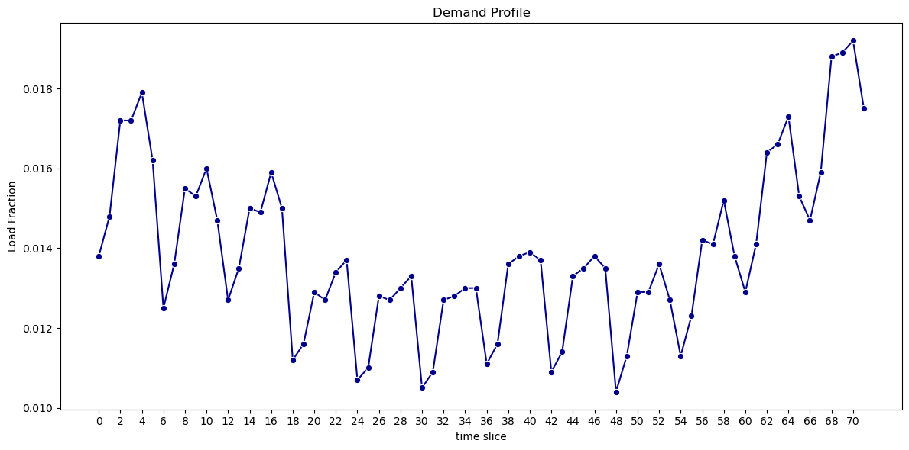

==============
3. Data inputs
==============
This section provides an overview of the data sources used in the Ukraine WESM model and describes their implementation.

3.1 Main data sources
=====================
The following table lists the principal data sources used to populate the model. Where available, Ukrainian national data has been prioritised, either directly incorporated into the model or used to validate existing datasets. This is particularly applicable to the 2020 Ukrainian energy balance, which serves as the baseline for final energy demand across all sectors.

For the agricultural, commercial, and industrial sectors, sectoral fuel use and activity data were primarily sourced from the State Statistics Service of Ukraine (Ukrstat) and supplemented with international sources (e.g., IEA energy balances, UN Energy Statistics) where gaps existed. The power and heat sector relies heavily on data published by Ukrenergo, the Ministry of Energy of Ukraine, and the Energy Community Secretariat, especially regarding generation capacity, fuel efficiency, and cross‑border interconnection.

Information for the residential sector, including the split between urban and rural households, cooking technologies, district heating reliance, and electrification trends, was derived from national statistics (Ukrstat household energy consumption surveys) and supplemented by analytical reports from the Energy Community, the World Bank, and the IEA.

Together, these sources ensure that the model reflects both the official Ukrainian energy statistics and internationally recognised datasets, while capturing the specific characteristics of Ukraine's energy system.

.. csv-table:: 
   :file: ./data/data_sources.csv
   :header-rows: 1

3.2 Global parameters
=====================

Global parameters are settings that affect the entire model's behavior.

DiscountRate
------------
The discount rate applied to the model is 15.5%.

YearSplit
---------
The duration of a timeslice as a fraction of the year is set in the YearSplit. The length of each timeslice is given by the combination of season and fraction of the day. Each season is represented by each month of the year. During the day, six representative time periods were selected. In total, 72 timeslices are provided by a unique combination of season time periods. The fractions of the day are: "0-3", "4-7", "8-11", "12-15", "16-19", "20-23". The figure below presents the electricity profile used in the model.

