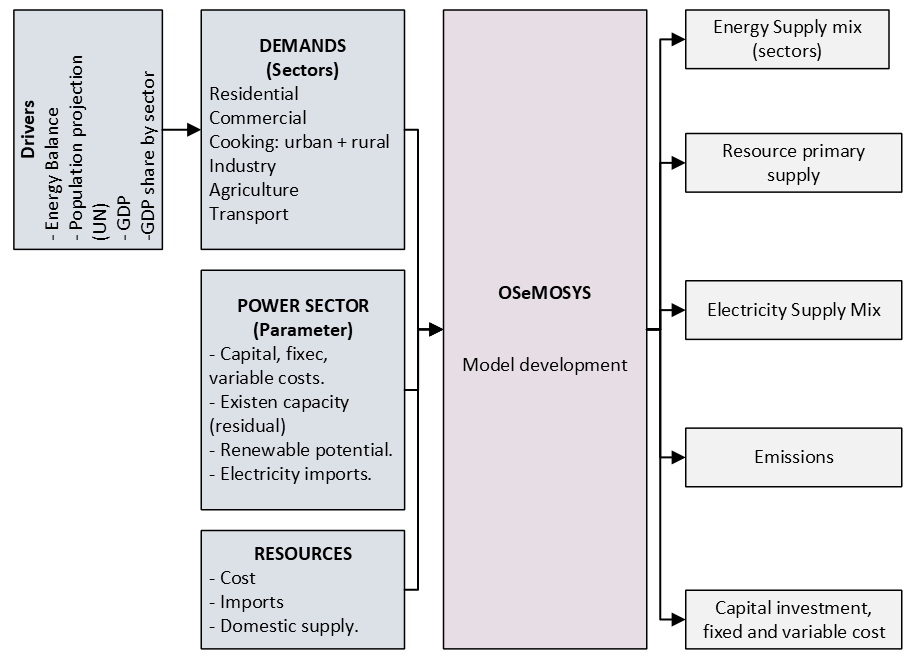
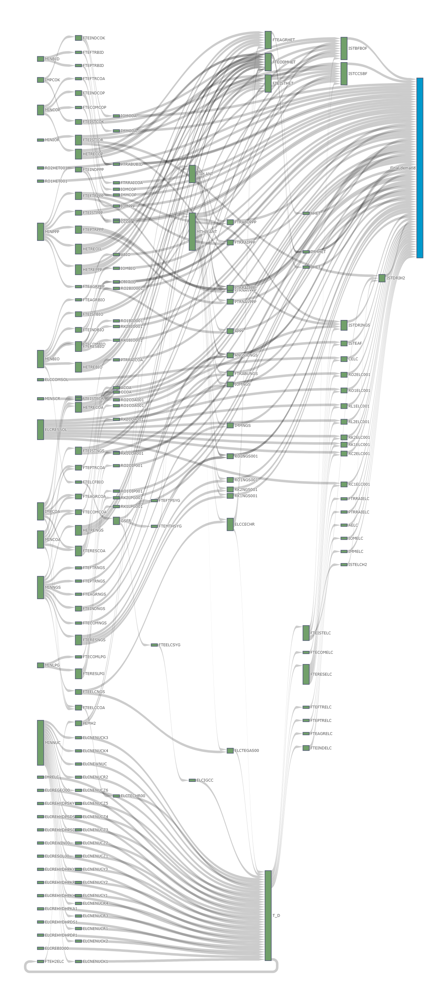
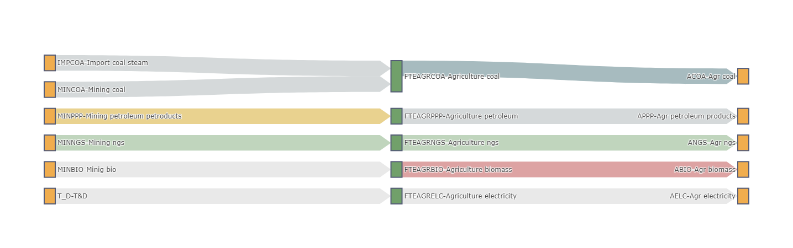
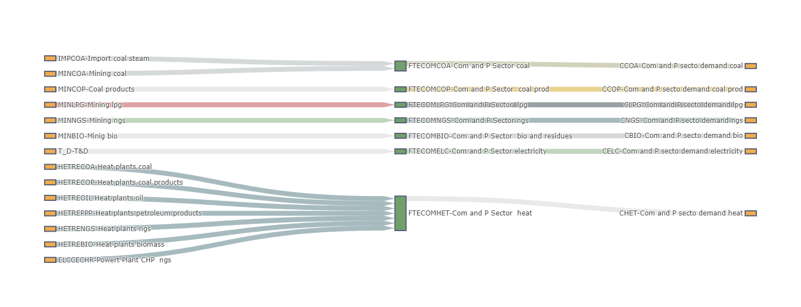
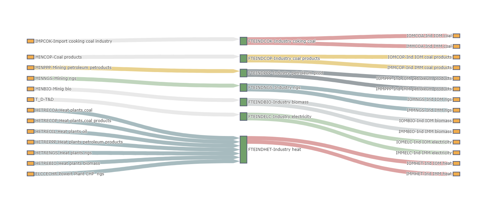
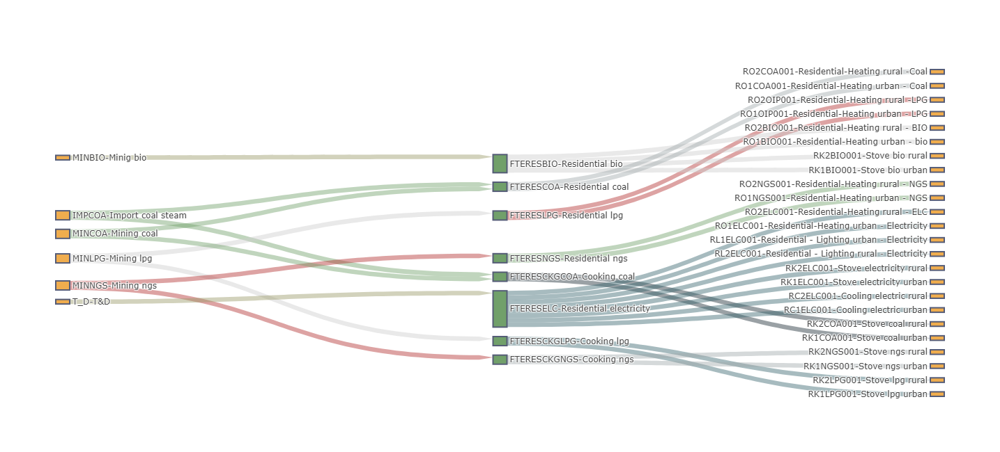
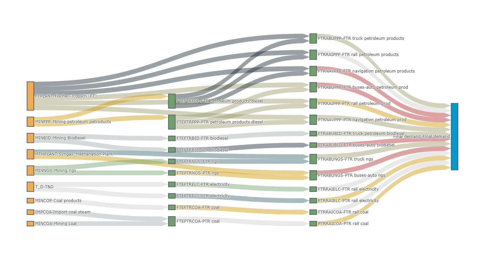
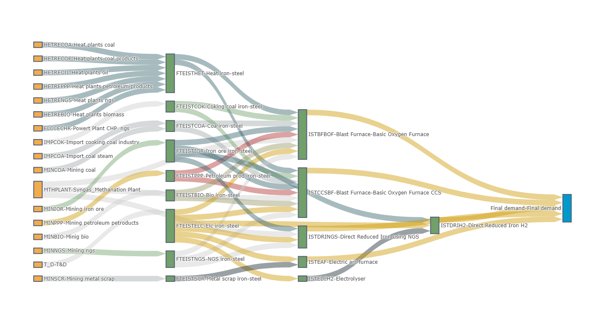

==================
1. Model structure
==================

The structure of the Ukraine WESM model is outlined in the sections that follow. Section 1.1 provides an overview of the overall model framework. In contrast, Section 1.2 explains how the OSeMOSYS sets have been configured for the Ukrainian context, including the full range of commodities, technologies, and emissions accounted for. These elements are then combined to form the Reference Energy System (RES), which is introduced in Section 1.3 and subsequently examined in greater detail—sector by sector—in Section 1.4.

1.1 General model structure 
===========================

The overall model framework is illustrated in the following figure. Primary energy in Ukraine can be either extracted domestically or imported. The country's energy system is characterised by a diverse resource base: significant nuclear capacity, domestic coal and natural gas, as well as growing contributions from renewables such as wind, solar, hydro, and biomass. Ukraine maintains substantial fossil fuel use, although its dependence on imports, especially natural gas, oil products, and coking coal, remains strategically important due to energy security concerns. Imported fuels and domestically produced energy are distributed across all sectors of the economy. The final energy demand of each sector is translated into energy service requirements within the model, enabling the identification of the cost-optimal technology mix to meet Ukraine's needs.

1.2 Model configuration - Sets
==============================

The  "sets" within the Ukraine WESM model define its overall structure, encompassing crucial details such as the model's temporal and geographical scope. These sets also comprehensively list all the fuels, energy technologies, and types of emissions considered in the analysis.

Region and years
----------------
The Ukraine WESM operates as a single-node national model, meaning it treats the entire country as one integrated energy system without explicitly modelling internal energy flows between different regions. Its time horizon spans from 2020 to 2050, with calculations performed in one-year increments. The initial period, specifically 2020 to 2022, is dedicated to model calibration, following the Energy Balance for Ukraine 2020.

Timeslices
----------
Timeslices are how the model represents temporal variations within a single year. The Ukraine WESM employs 72 distinct timeslices, derived from combining 12 seasons (one for each month) and six specific time intervals throughout each day. This detailed temporal resolution allows for a nuanced capture of energy demand and supply fluctuations.

Fuels/Commodities
-----------------
Fuels in the Ukraine WESM include all commodities represented in the model, whether primary or secondary. Both categories may be sourced domestically or imported. Ukraine possesses significant domestic resources, including coal, natural gas, hydroelectric power, biomass, solar energy, and wind energy, while still relying on imports of oil products and, historically, natural gas to meet its demand. Imported fuels can be used across multiple sectors and include crude oil, petroleum products (such as diesel, gasoline, jet fuel, LPG, kerosene, and heavy fuel oil), as well as natural gas. Locally, renewable-based secondary carriers such as bioethanol, biogas, and biomass-derived heat and power are considered. Electricity is generated from the country's diverse mix of power plants—dominated by nuclear, hydro, coal, and an increasing share of renewables—and may also be exchanged through cross-border interconnectors with neighbouring European systems. To facilitate model analysis, sector-specific fuel categories are mapped to broader generic fuels via simplified "fuel-technology mix" (FTE) technologies. Finally, as in other OSeMOSYS applications, demands are represented as fuels, each identified by the prefix DEM.

.. csv-table:: 
   :file: ./data/fuel_commodity.csv
   :widths: 30, 70
   :align: left
   :header-rows: 1

Technologies and modes of operation
-----------------------------------
All technologies included in the Ukraine WESM are organised within the technologies set. Imported fuels and resources (IMP) and domestic resources (MIN) are characterised by technologies that generate only an output fuel. The power sector is modelled at an individual power plant level (ELC technologies), reflecting the diversity of Ukraine's generation mix, which includes nuclear, thermal, hydro, and renewable assets. Transmission and distribution (T_D) networks are represented by a single technology to capture system-level losses. Each end-use sector is connected to the energy system through fuel-technology mix (FTE) technologies, one for each fuel available within that sector. These FTEs facilitate the post-processing of model results while also enabling the representation of sector-specific costs and efficiencies that are not directly embedded in the technology definitions. Beyond this, each sector features its own dedicated technologies—identified with sector-specific prefixes—that transform the available fuels into useful energy services (e.g., transport mobility, industrial heat, residential heating, etc.). For the present modelling framework, only one operating mode is assigned per technology.

.. csv-table:: 
   :file: ./data/technologies.csv
   :widths: 30, 70
   :align: left
   :header-rows: 1

Emissions
---------
The current version of the Ukraine WESM explicitly tracks only CO\ :sub:`2` emissions. The emissions set includes both a generic CO\ :sub:`2` category applicable across the entire energy system, as well as sector-specific CO\ :sub:`2` entries that allow emissions to be attributed to particular end-use sectors.

.. csv-table:: 
   :file: ./data/emissions.csv
   :widths: 30, 70
   :align: left
   :header-rows: 1

1.3 Reference energy system
===========================

An overview of the complete reference energy system (RES) for Ukraine is shown in the following figure. Beginning on the left, each block represents one or more technologies, depending on whether the associated commodity is domestically produced or imported. The bottom part of the diagram illustrates the power sector (ELC technologies). Each block can correspond to as many as thirty-four individual power plants, since generation in the model is represented at the single-plant level for nuclear power plants and at the global level for other power plants, such as coal and natural gas. Electricity imports are modelled at the transmission stage. At the same time, distribution to the end‑use sectors occurs after both transmission/distribution grids (T_D), with system losses incorporated. Below the uranium production section, other fuels that are consumed directly in end-use sectors are listed, alongside downstream conversion processes such as biomass-to-syngas, which generate secondary fuels. Each end-use sector is represented separately, bounded by the fuel-technology mix (FTE) technologies, and includes its own sector-specific fuels, technologies, and final energy service demands.

 
1.4 Sectors
===========

Agriculture
-----------

The Ukraine WESM features a more detailed representation of agricultural energy use, with distinct demand categories for coal, petroleum products, natural gas, biomass, electricity, and heat. Each fuel type is linked to corresponding technologies that supply the sector, enabling a more comprehensive analysis of Ukraine's agricultural energy mix and its potential transition pathways.

Commercial sector
-----------------

In the Ukraine WESM, the commercial and public services sector is modelled with a broader set of fuel demands, reflecting the sector's diverse energy requirements. These include coal, petroleum products, LPG, natural gas, biomass, electricity, and heat. Each demand category is linked to the relevant technologies, enabling the model to capture Ukraine's reliance on both fossil fuels and district heating, as well as its growing electricity demand.

  
Industry
--------
The industrial sector in the Ukraine WESM is represented with more complexity than agriculture or commercial services. It is divided into subsectors, including non-metals and cement (IMM), other manufacturing and processes (IOM), and food processing. Tthe Ukrainian framework considers a broad range of fuels and carriers for industrial activities.

For both IMM and IOM subsectors, demand categories are explicitly defined for coal, coal products, petroleum products, natural gas, biomass, electricity, and heat. This structure reflects the energy‑intensive nature of Ukraine's industries, particularly steel, cement, and chemicals, which remain major consumers of coal, natural gas, and heat. Meanwhile, food processing and lighter manufacturing are also included, with a stronger emphasis on electricity and heat.

Residential sector
------------------

The residential sector is a complex component of the Ukraine WESM, reflecting both its size and its dominant share of final energy consumption. Energy service demands are divided into cooling, cooking, lighting, and heating/hot water, with each category further disaggregated into urban and rural households to capture geographic and socio‑economic differences.

The Ukrainian context is heavily shaped by space heating and hot water demand, given the country's cold climate and widespread district heating networks. Residential heating can be covered by a broad portfolio of fuels and technologies, including natural gas boilers, coal stoves, biomass burners, electric heaters, and district heating connections. Cooking is also represented by multiple technological variants, spanning gas stoves, electric stoves, LPG stoves, and traditional biomass devices. Lighting relies almost exclusively on electricity in both urban and rural areas. At the same time, cooling demand, although currently small, is met by electricity-based appliances.

  
Transport
----------

The transport sector in Ukraine, as covered by WESM, encompasses road, rail, and navigation (shipping). Road transport is represented across key modes, including buses, passenger cars, and freight trucks. More minor modes, such as two- and three-wheelers, relevant in other regions, are not explicitly included, given their limited role in Ukraine.

Each road subsector has multiple technology options, reflecting the expanding diversity of Ukraine's vehicle fleet. These include petroleum products (such as diesel and gasoline), natural gas (CNG/LNG), biodiesel blends, and, in the case of buses and passenger cars. For freight trucks, liquid fuels still dominate. Still, options such as natural gas and biodiesel are also incorporated to account for potential fuel switching.

The railway system is represented by technologies using coal, diesel, and electricity, reflecting the sector's historical reliance on fossil fuels and its ongoing partial electrification. Passenger rail demand is increasingly electrified, but diesel still plays a role in non‑electrified corridors.

Aviation demand is satisfied exclusively by technologies using jet fuel (kerosene‑based aviation fuel). In contrast, navigation demand (inland and maritime shipping) relies on petroleum products such as heavy fuel oil and diesel.

Iron and Steel
--------------

The iron and steel sector in Ukraine's WESM is explicitly modelled due to its central role in the country's economy and its significant contribution to energy use and CO₂ emissions. Conventional steelmaking technologies are represented, including the Blast Furnace (BF), Basic Oxygen Furnace (BOF), Open Hearth Furnace (OHF), and Electric Arc Furnace (EAF), which capture the diversity of Ukraine's current steel production base. In addition to these conventional routes, the model also incorporates low‑carbon steelmaking options. These include the CCS‑equipped Blast Furnace–Basic Oxygen Furnace (CCS BF‑BOF) pathway, which reduces emissions by capturing and storing CO₂; Direct Reduced Iron using Natural Gas (DRI‑NG), a less carbon‑intensive alternative; and Direct Reduced Iron using Hydrogen (DRI‑H₂), coupled with an electrolyser to produce the required hydrogen from water and electricity. By incorporating both traditional and emerging low-carbon routes, the model facilitates the evaluation of transition pathways for Ukraine's steel industry, taking into account energy demand, opportunities for emission reduction, and technological shifts over time.

Low carbon fuels
----------------

The model also incorporates low carbon fuels pathways, which play an important role in decarbonising the transport and power sectors. Syngas (SYG) is produced through gasification processes (GSFR), often using low carbon biomass as feedstock, and can be further converted into synthetic natural gas (SNG) through a methanation process (MTHPLANT). Alternatively, syngas can be directed into a Fischer–Tropsch (FT) plant, which yields FT diesel (FTDSL) as a liquid low carbon fuel, while also capturing and accounting for associated CO₂ emissions. In addition, the system considers the use of hydrogen (H₂) both as a direct input to syngas upgrading and as a complementary pathway to synthetic fuel production. The model also includes the ELCIGCC technology, where syngas is used directly in an integrated gasification combined cycle (IGCC) power plant to generate electricity more efficiently while offering the potential for carbon capture integration. By modelling these conversion routes, the framework captures the potential of advanced low carbon fuels to substitute conventional fossil fuels in Ukraine’s energy mix, supporting deep emission reductions and offering flexibility across multiple demand sectors.

.. image:: ./fig/wesm_lcf.png
  :width: 1000
  :alt: low carbon fuel
